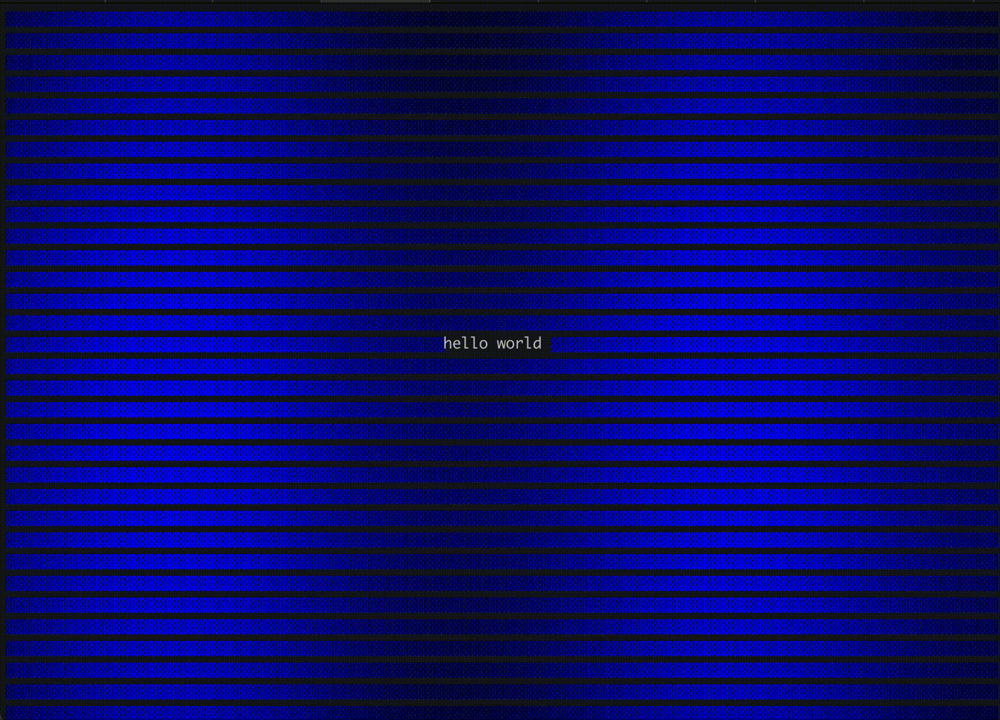

# reveal-rs

A terminal animation app written in Rust.



## Usage

```
Usage: reveal [OPTIONS] --style <STYLE> --text <TEXT>

Options:
      --style <STYLE>        [possible values: rainbow, explosion, waves, waves-gradient]
  -t, --text <TEXT>
  -d, --duration <DURATION>  Animation duration in milliseconds (infinite if 0) [default: 5000]
  -h, --help                 Print help
  -V, --version              Print version
```

## License

MIT
